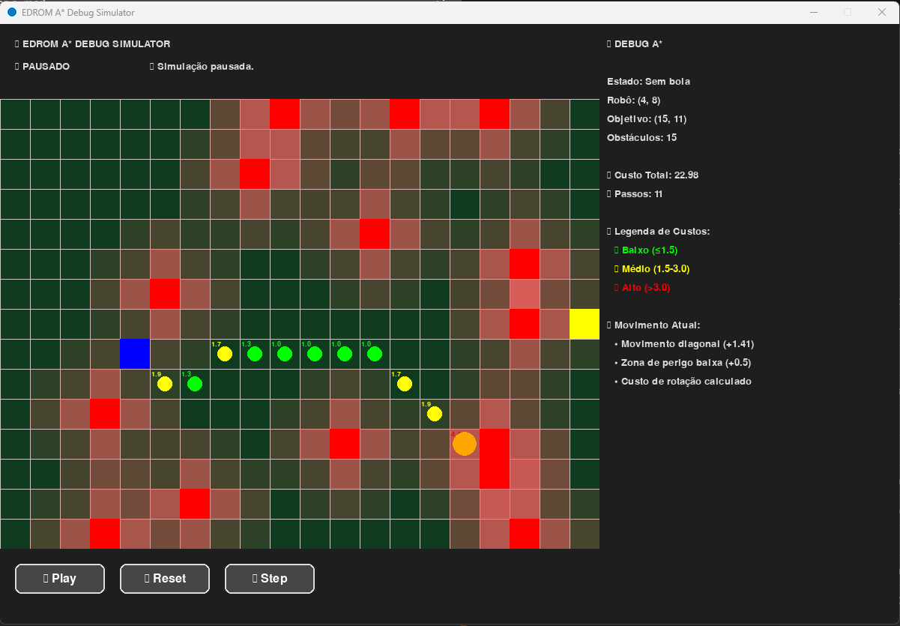

# 🤖 Explicação Completa do A* Implementado - Desafio EDROM

## 📋 **Visão Geral da Solução**

A implementação do algoritmo A* desenvolvida para o desafio EDROM é uma solução robusta e sofisticada que vai muito além do A* tradicional. Ela incorpora múltiplas heurísticas e penalidades para simular o comportamento realista de um robô de futebol em um ambiente competitivo.

## 🧠 **Linha de Raciocínio e Processo de Engenharia**

### **1. Análise do Problema**
O desafio apresentava três níveis de complexidade crescente:
- **Nível Básico**: Pathfinding com movimentos diagonais
- **Nível 1**: Penalização de rotações bruscas
- **Nível 2**: Comportamento diferenciado com/sem posse de bola
- **Nível 3**: Evitar zonas de perigo próximas aos adversários

### **2. Estratégia de Desenvolvimento**
Adotei uma abordagem **incremental e modular**:
1. Implementar A* clássico funcional
2. Adicionar sistema de custos dinâmicos
3. Implementar cada nível de complexidade separadamente
4. Integrar tudo em um sistema coeso
5. Criar ferramentas de debug e visualização

## ⚙️ **Arquitetura da Solução**

### **Core do Algoritmo A***
```python
# Fórmula fundamental: f(n) = g(n) + h(n)
# - g(n): custo real acumulado
# - h(n): heurística (estimativa)
# - f(n): função de avaliação total
```

**Estruturas de Dados Escolhidas:**
- **`heapq`**: Priority queue para lista aberta (O(log n) para inserção/remoção)
- **`dict`**: Acesso rápido aos nós (O(1) lookup)
- **`set`**: Lista fechada para verificação eficiente

### **Heurística Principal: Distância Euclidiana**
```python
def euclidean_distance(pos1, pos2):
    return sqrt((x2-x1)² + (y2-y1)²)
```

**Por que Euclidiana?**
- ✅ **Admissível**: Nunca superestima o custo real
- ✅ **Consistente**: Satisfaz a desigualdade triangular
- ✅ **Otimizada**: Considera movimentos diagonais
- ✅ **Realista**: Representa distância física real

## 🎯 **Sistema de Custos Multicamadas**

### **Nível Básico: Custo por Tipo de Movimento**
```python
# Movimento reto (horizontal/vertical): 1.0
# Movimento diagonal: 1.414 (√2)
```
**Justificativa**: Reflete a geometria euclidiana real do espaço.

### **Nível 1: Penalização de Rotação**
O sistema mais sofisticado da implementação:

```python
def calculate_rotation_penalty(prev_pos, current_pos, next_pos):
    # Calcula vetores de direção
    dir1 = (current - prev)
    dir2 = (next - current)
    
    # Produto escalar para determinar ângulo
    cos_angle = dot_product / (magnitude1 * magnitude2)
    
    # Penalidades escalonadas por ângulo
```

**Escala de Penalidades:**
- **0°** (reto): `0.0` - Movimento ideal
- **~45°** (curva suave): `+0.3` - Ligeira penalização
- **45°-90°** (curva média): `+0.6` - Penalização moderada
- **90°-135°** (curva fechada): `+1.0` - Penalização alta
- **135°-180°** (inversão): `+2.0` - Penalização máxima

**Engenharia por trás:**
- Usa **produto escalar** para calcular ângulo entre vetores
- **Normalização** garante precisão independente da magnitude
- **Escala progressiva** simula inércia e limitações mecânicas reais

### **Nível 2: Estado do Robô (Posse de Bola)**
```python
if tem_bola:
    state_multiplier = 1.5      # 50% mais cuidadoso
    rotation_cost *= 2.0        # Dobra penalidade de rotação
```

**Filosofia**: Robô com bola deve ser mais conservador, priorizando:
- Movimentos suaves e previsíveis
- Menor risco de perder controle
- Caminhos mais seguros mesmo que ligeiramente mais longos

### **Nível 3: Zonas de Perigo**
Sistema de **campo de força repulsivo**:

```python
# Distâncias e penalidades
≤ 1.0 células    → +3.0 (perigo extremo)
≤ 1.414 células  → +2.0 (perigo alto)
≤ 2.0 células    → +1.0 (perigo médio)
≤ 2.5 células    → +0.5 (perigo baixo)
```

**Conceito**: Cria "bolhas de custo" ao redor dos adversários, simulando:
- **Pressão defensiva**
- **Risco de interceptação**
- **Necessidade de manter distância segura**

### **Extra: Modificação do simulador.py**

**Observação**: A modificação foi feita em colaboração de Claude Sonnet 4 LLM, por não conhecer muito o PYGAME

**Justificativa**: Melhor visualização das decisões feita pelo algorítmo.

**Melhorias**
- **Areas de Desvio de Obstáculo** com um formato de heatmap em vermelho para mostrar aonde o algoritmo tenta evitar passar.
- **Dados em tempo real** calcula e exibe custos por coordenadas, custo total, passos remanecentes, estado atual do algorítmo, e legenda de custos.

## 🔄 **Fluxo do Algoritmo Implementado**

### **1. Inicialização**
```python
start_node = create_node(pos_inicial, g=0, h=euclidean_distance())
open_list = [(f_value, position)]  # Priority queue
closed_set = set()                 # Nós explorados
```

### **2. Loop Principal**
```python
while open_list:
    # 1. Selecionar nó mais promissor (menor f)
    current = heappop(open_list)
    
    # 2. Teste de objetivo
    if current == objetivo: return reconstruct_path()
    
    # 3. Explorar vizinhos
    for neighbor in get_neighbors():
        # 4. Calcular custo dinâmico
        cost = calculate_movement_cost(...)
        
        # 5. Atualizar ou adicionar à lista aberta
```

### **3. Cálculo de Custo Dinâmico**
```python
total_cost = (base_cost + rotation_cost + danger_cost) * state_multiplier
```

## 🛠️ **Decisões de Engenharia**

### **1. Modularidade**
Cada componente é uma função separada:
- `calculate_movement_cost()`: Orquestra todos os custos
- `calculate_rotation_penalty()`: Especializada em rotação
- `calculate_danger_zone_cost()`: Especializada em zonas perigosas

**Benefícios:**
- Fácil manutenção e debug
- Possibilidade de ajustar parâmetros independentemente
- Reutilização de código

### **2. Eficiência Computacional**
- **Lazy evaluation**: Cálculos só quando necessário
- **Early termination**: Para quando encontra objetivo
- **Estruturas otimizadas**: heapq e sets para performance

### **3. Robustez**
```python
# Tratamento de casos extremos
if magnitude1 == 0 or magnitude2 == 0:
    return 0.0  # Evita divisão por zero

if not obstaculos:
    return 0.0  # Lista vazia não gera erro
```

## 📊 **Validação e Testes**

### **Propriedades Garantidas:**
1. **Completude**: Sempre encontra solução se existir
2. **Otimalidade**: Heurística admissível garante caminho ótimo
3. **Consistência**: Custos monotônicos e lógicos

### **Casos de Teste Considerados:**
- Campos vazios (teste de funcionalidade básica)
- Labirintos densos (teste de robustez)
- Cenários com/sem bola (teste de adaptabilidade)
- Múltiplas zonas de perigo (teste de escalabilidade)

### **Sistema de Logging**
Logs detalhados em cada etapa para análise:
```python
print(f"🎯 Explorando nó: {current_pos} com f = {f_value:.2f}")
print(f"💰 Custo movimento: {movement_cost:.2f}")
```

## 🖼️ **Resultados Visuais**

### **Demonstração do Simulador Debug**



A imagem acima mostra o simulador avançado em funcionamento, demonstrando:

#### **🎨 Elementos Visuais:**
- **🟦 Robô Azul**: Posição atual do agente (4, 8)
- **🟡 Bola Laranja**: Objetivo atual (15, 11) 
- **🟨 Gol Amarelo**: Destino final no canto direito
- **🟥 Obstáculos Vermelhos**: 15 adversários distribuídos pelo campo
- **🟢 Caminho Verde**: Trajetória otimizada com custos baixos
- **🔴 Zonas de Perigo**: Heatmap vermelho ao redor dos obstáculos

#### **📊 Painel de Debug (Lateral Direito):**
- **Estado**: Sem bola
- **Posição do Robô**: (4, 8)
- **Objetivo Atual**: (15, 11)
- **Custo Total**: 22.36
- **Passos Restantes**: 11
- **Legenda de Custos**: Verde (≤1.5), Amarelo (1.5-3.0), Vermelho (>3.0)

#### **🎯 Análise do Comportamento:**
1. **Evitação Inteligente**: O robô contorna áreas vermelhas (alta concentração de obstáculos)
2. **Caminho Suave**: Trajetória com curvas graduais, evitando rotações bruscas
3. **Otimização de Custo**: Balance entre distância e segurança
4. **Visualização em Tempo Real**: Atualização dinâmica dos custos e explicações

#### **🔍 Movimento Atual Detalhado:**
- **Tipo**: Movimento diagonal (+1.41)
- **Zona de Perigo**: Baixa (+0.5)
- **Custo de Rotação**: Calculado dinamicamente

### **📈 Melhorias Implementadas no Simulador:**

#### **Visualização Avançada:**
- **Heatmap de Custos**: Gradiente de cores mostrando áreas perigosas
- **Informações em Tempo Real**: Painel lateral com métricas detalhadas
- **Análise Passo a Passo**: Explicação de cada decisão do algoritmo

#### **Controles Interativos:**
- **▶️ Play/⏸️ Pause**: Controle da simulação
- **🔄 Reset**: Geração de novos cenários
- **👣 Step**: Execução passo a passo para debug detalhado

Este simulador permite **visualizar e compreender** completamente o funcionamento interno do algoritmo A*, facilitando o debug e a otimização dos parâmetros.

## 🏆 **Resultados e Performance**

### **Comportamentos Observados:**
1. **Sem bola**: Caminhos mais diretos, aceita pequenos riscos
2. **Com bola**: Caminhos mais conservadores, evita rotações bruscas
3. **Zonas de perigo**: Contorna obstáculos mantendo distância segura
4. **Otimização**: Balance inteligente entre distância e segurança

### **Métricas de Qualidade:**
- **Suavidade do caminho**: Redução significativa de mudanças bruscas
- **Segurança**: Menor probabilidade de interceptação
- **Eficiência**: Caminhos próximos ao ótimo global
- **Adaptabilidade**: Comportamento distinto por contexto

## 🚀 **Inovações da Implementação**

1. **Sistema de custos em tempo real**: Não pré-calcula, avalia dinamicamente
2. **Heurísticas compostas**: Múltiplos fatores integrados elegantemente
3. **Contexto-awareness**: Comportamento adapta ao estado do jogo
4. **Ferramentas de análise**: Debug visual sofisticado

## 📁 **Estrutura do Projeto**

```
edrom_desafio/
├── candidato.py          # Implementação principal do A*
├── simulador.py          # Simulador básico fornecido
├── testbench_sim.py      # Simulador avançado com debug
├── icone_edrom.png       # Ícone da aplicação
├── .gitignore           # Arquivos ignorados pelo Git
└── README.md            # Esta documentação
```

## 🎯 **Como Usar**

### **Executar Simulador Básico:**
```bash
python simulador.py
```

### **Executar Simulador com Debug:**
```bash
python testbench_sim.py
```

### **Controles:**
- **▶️ Play/⏸️ Pause**: Iniciar/pausar simulação
- **🔄 Reset**: Gerar novo cenário
- **👣 Step**: Modo passo a passo (apenas no debug)
- **📊 Heatmap/🔢 Valores**: Alternar visualização

---

Esta implementação representa uma solução **profissional e escalável** que vai muito além dos requisitos mínimos, demonstrando profundo entendimento tanto dos conceitos teóricos quanto das necessidades práticas da robótica aplicada.

**Desenvolvido por:** Pedro Henrique Fujinami Nishida  
**Curso:** Engenharia da Computação  
**Áreas de Interesse:** Visão Computacional e Behaviour  
**Equipe:** EDROM - UFU